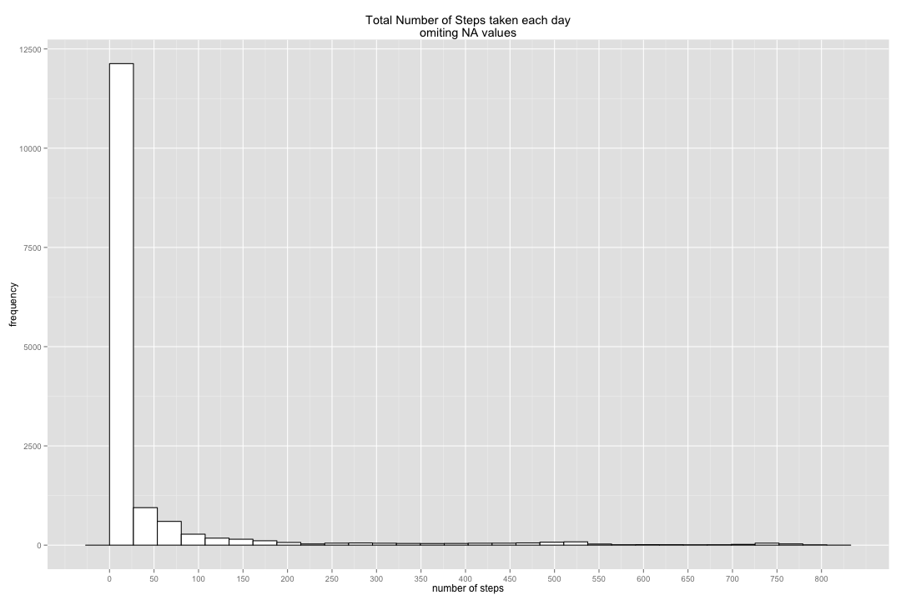
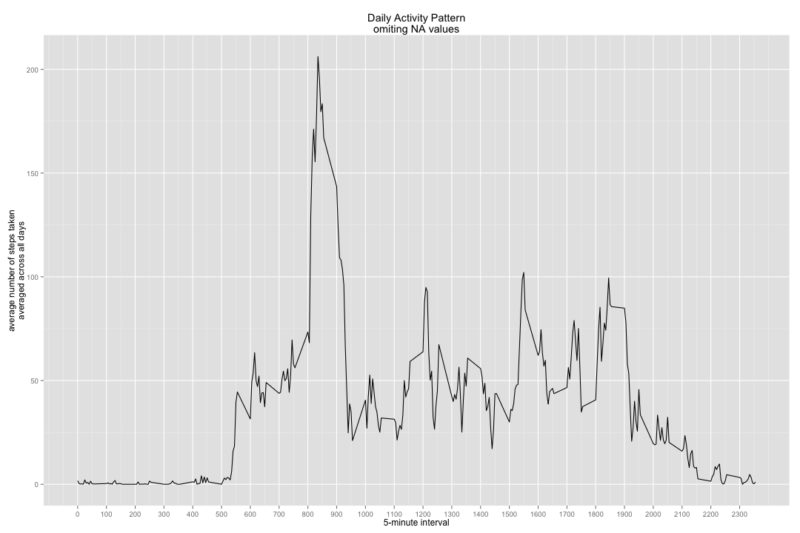
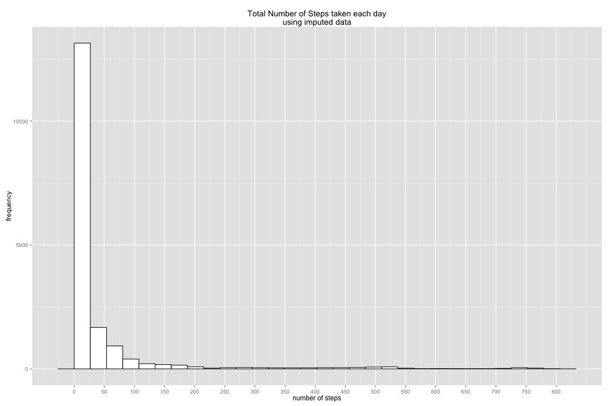
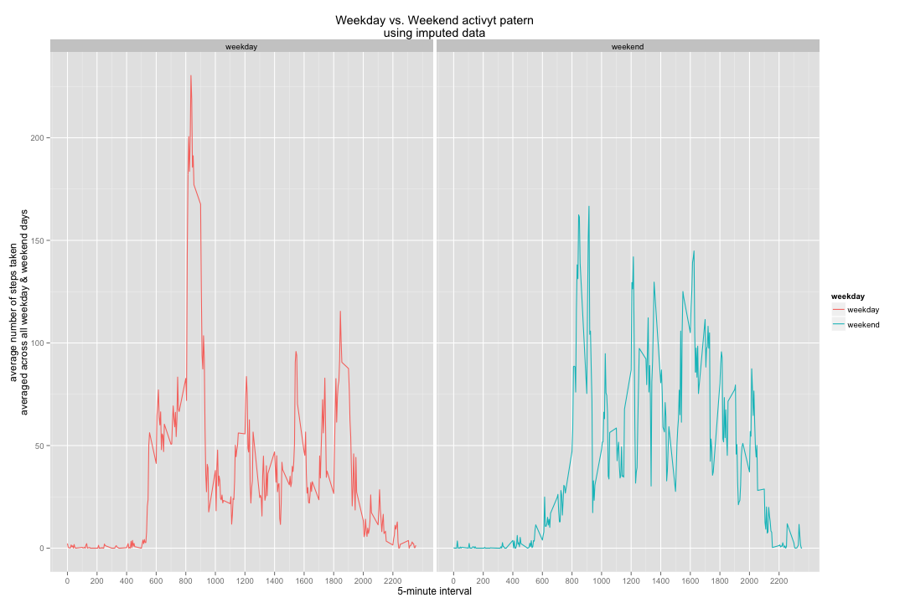

# Reproducible Research: Peer Assessment 1

Assignment completed by szelenka on 2014-07-15.

### Verify required libraries are installed and loaded

Check the system to ensure they have the proper packages installed, and at the correct versions used when this script was originally exectued.  Since running lapply or install.packages requires ***base*** and ***utils*** to be installed prior, we cannot automate the installation of correct versions.  So simply report it here.


```r
m_original = data.frame(Package = c("base","utils","plyr","ggplot2","knitr"), 
                  Version = c("3.0.3","3.0.3","1.8.1","1.0.0","1.6"))
m_installed = as.data.frame(installed.packages()[,c("Package","Version")])
print(m_original)
```

```
##   Package Version
## 1    base   3.0.3
## 2   utils   3.0.3
## 3    plyr   1.8.1
## 4 ggplot2   1.0.0
## 5   knitr     1.6
```

```r
m_installed = m_installed[m_installed$Package %in% m_original$Package,]
print(m_installed)
```

```
##         Package Version
## base       base   3.0.3
## ggplot2 ggplot2   1.0.0
## knitr     knitr     1.6
## plyr       plyr   1.8.1
## utils     utils   3.0.3
```

```r
library(base)
library(utils)
library(plyr)
library(ggplot2)
library(knitr)
```

### Setup default knitr parameters

Set the code echo to ***TRUE*** even though it's set by default.  Also set the figure dimensions so they render decently in HTML.


```r
opts_chunk$set(echo = TRUE, fig.width = 15, fig.height = 10)
```

### Dump system information

Produce an output of what type of system this code was written and executed on.


```r
sessionInfo()
```

```
## R version 3.0.3 (2014-03-06)
## Platform: x86_64-apple-darwin10.8.0 (64-bit)
## 
## locale:
## [1] en_US.UTF-8/en_US.UTF-8/en_US.UTF-8/C/en_US.UTF-8/en_US.UTF-8
## 
## attached base packages:
## [1] stats     graphics  grDevices utils     datasets  methods   base     
## 
## other attached packages:
## [1] ggplot2_1.0.0 plyr_1.8.1    knitr_1.6    
## 
## loaded via a namespace (and not attached):
##  [1] colorspace_1.2-4 digest_0.6.4     evaluate_0.5.5   formatR_0.10    
##  [5] grid_3.0.3       gtable_0.1.2     MASS_7.3-29      munsell_0.4.2   
##  [9] proto_0.3-10     Rcpp_0.11.1      reshape2_1.4     scales_0.2.4    
## [13] stringr_0.6.2    tools_3.0.3
```

## Loading and preprocessing the data

Since the GitHub repository also contains the dataset for the assignment, we don't download it in R code here.  It's assumed to exist in the same directory as this R Markdown file.

### Extract the raw data
Only extract the raw data to the ***data*** directory only if it doesn't exist.  Verify the ***data/activity.csv*** file exists prior to continuing.


```r
sourceData = "activity.zip"
dataDirectory = "data"
dataFile = "activity.csv"
getwd()
```

```
## [1] "/Users/szelenka/Documents/_svn/datasciencecoursera/repdata/RepData_PeerAssessment1"
```

```r
if (!file.exists(sourceData)) {
  stop(paste("Unable to locate source data file:",sourceData))
}
if (!file.exists(dataDirectory)) {
  fileList = unzip(sourceData, exdir = dataDirectory)
}
if (!file.exists(file.path(dataDirectory,dataFile))) {
  stop(paste("Unable to locate data file:", dataDirectory, "/", dataFile))
}
```

### Load the data (i.e. read.csv())

Simply load the raw data file into R.  Do not perform any process/transform on the data in this step.  The process/transform will happen at a later step, per the assignment directions.


```r
data = read.csv(file.path(dataDirectory,dataFile))
str(data)
```

```
## 'data.frame':	17568 obs. of  3 variables:
##  $ steps   : int  NA NA NA NA NA NA NA NA NA NA ...
##  $ date    : Factor w/ 61 levels "2012-10-01","2012-10-02",..: 1 1 1 1 1 1 1 1 1 1 ...
##  $ interval: int  0 5 10 15 20 25 30 35 40 45 ...
```

### Process/transform the data (if necessary) into a format suitable for your analysis

Alter the data loaded into R.  
- The ***NA*** fields are already converted to NA objects from read.csv, so no modification is needed there.  
- The ***date*** field needs to be converted to a date field.


```r
data$date = strptime(data$date,format="%Y-%m-%d")
summary(data)
```

```
##      steps            date                        interval   
##  Min.   :  0.0   Min.   :2012-10-01 00:00:00   Min.   :   0  
##  1st Qu.:  0.0   1st Qu.:2012-10-16 00:00:00   1st Qu.: 589  
##  Median :  0.0   Median :2012-10-31 00:00:00   Median :1178  
##  Mean   : 37.4   Mean   :2012-10-31 00:25:34   Mean   :1178  
##  3rd Qu.: 12.0   3rd Qu.:2012-11-15 00:00:00   3rd Qu.:1766  
##  Max.   :806.0   Max.   :2012-11-30 00:00:00   Max.   :2355  
##  NA's   :2304
```

## What is mean total number of steps taken per day?

For this part of the assignment, you can ignore the missing values in the dataset.

Produce a histogram using ggplot2 with custom labels and breaks.  We use breaks every 50 steps to give a general idea of where the majority of data lies.

### Make a histogram of the total number of steps taken each day


```r
binwidth = max(range(data$steps, na.rm = TRUE))/30
graph = ggplot(data, aes(x=steps))
graph + geom_histogram(colour = "black", fill = "white", binwidth = binwidth, na.rm = TRUE) + labs(
    x = "number of steps",
    y = "frequency",
    title = "Total Number of Steps taken each day\nomiting NA values"
  ) + scale_x_continuous(
    breaks=seq(0,max(data$steps, na.rm = TRUE),50)
  )
```

 

### Calculate and report the mean and meadian total number of steps taken per day

Specifically call ***mean*** and ***median*** to satisfy the requirement.  We could also just as easily used ***summary***.


```r
mean(data$steps, na.rm = TRUE)
```

```
## [1] 37.38
```

```r
median(data$steps, na.rm = TRUE)
```

```
## [1] 0
```

## What is the average daily activity pattern?

### Make a time series plot (i.e. type = "l") of the 5-minute interval (x-axis) and the average number of steps taken, averaged across all days (y-axis)

Use ***ddply*** to generate the mean for each row into the ***avg_steps*** data.frame which will be used to chart the plot.

Produce a line plot using ggplot2 with custom labels and breaks.  We use breaks every 100 intervals to give a general idea of where the daily hour breaks are.


```r
avg_steps = ddply(data, .(interval), summarise, mean_steps = mean(steps, na.rm=TRUE))
graph = ggplot(avg_steps, aes(x=interval, y=mean_steps))
graph + geom_line(na.rm = TRUE) + labs(
    x = "5-minute interval",
    y = "average number of steps taken\naveraged across all days",
    title = "Daily Activity Pattern\nomiting NA values"
  ) + scale_x_continuous(
    breaks=seq(min(avg_steps$interval),max(avg_steps$interval),100)
  )
```

 

### Which 5-minute interval, on average across all the days in the dataset, contains the maximum number of steps?

Subset the ***avg_steps*** to extract the ***interval*** value for the maximum value of ***mean_steps***.


```r
avg_steps[avg_steps$mean_steps == max(avg_steps$mean_steps),"interval"]
```

```
## [1] 835
```

## Imputing missing values

Note that there are a number of days/intervals where there are missing values (coded as NA). The presence of missing days may introduce bias into some calculations or summaries of the data.

### Calculate and report the total number of missing values in the dataset (i.e. the total number of rows with NAs)

Call ***count()*** and ***is.na()*** on ***data*** to get a data.frame of all possible combinations of rows with NA values.


```r
count(is.na(data))
```

```
##   x.steps x.date x.interval  freq
## 1   FALSE  FALSE      FALSE 15264
## 2    TRUE  FALSE      FALSE  2304
```

### Devise a strategy for filling in all of the missing values in the dataset. The strategy does not need to be sophisticated. For example, you could use the mean/median for that day, or the mean for that 5-minute interval, etc. 

Strategy for imputing missing data is to replace NA values by using information from related observations.  This involves taking the mean of all recorded (non-NA) values for a given interval, then replacing NA values at that interval with this calculated value.

### Create a new dataset that is equal to the original dataset but with the missing data filled in.

Copy ***data*** to ***imputed.data*** then apply a custom function to fill in the missing data using the strategy outlined above.  Then assign this output back to ***steps***.  Here we're using ***avg_steps*** as calculated previously to assgin a value to NA values using the ***interval*** as the index.


```r
imputed.data = data
imputed.data$steps = apply(data[,c("steps","interval")], 1, function(x,avg){
    if (is.na(x['steps'])) {
        return(avg[avg$interval == x['interval'],'mean_steps'])
    }
    return(x['steps'])
}, avg_steps)
```

### Make a histogram of the total number of steps taken each day and Calculate and report the mean and median total number of steps taken per day. Do these values differ from the estimates from the first part of the assignment? What is the impact of imputing missing data on the estimates of the total daily number of steps?

Produce a histogram using ggplot2 with custom labels and breaks.  We use breaks every 50 steps to give a general idea of where the majority of data lies.

Specifically call ***mean*** and ***median*** to satisfy the requirement.  We could also just as easily used ***summary***.

To answer "What is the impact of imputing missing data ...", there does not appear to be any significat change to the mean or median between ***data*** and ***imputed.data***.


```r
binwidth = max(range(imputed.data$steps, na.rm = TRUE))/30
graph = ggplot(imputed.data, aes(x=steps))
graph + geom_histogram(colour = "black", fill = "white", binwidth = binwidth, na.rm = TRUE) + labs(
    x = "number of steps",
    y = "frequency",
    title = "Total Number of Steps taken each day\nusing imputed data"
  ) + scale_x_continuous(
    breaks=seq(0,max(imputed.data$steps),50)
  )
```

 

```r
mean(imputed.data$steps)
```

```
## [1] 37.38
```

```r
median(imputed.data$steps)
```

```
## [1] 0
```

## Are there differences in activity patterns between weekdays and weekends?

For this part the weekdays() function may be of some help here. Use the dataset with the filled-in missing values for this part.

### Create a new factor variable in the dataset with two levels - "weekday" and "weekend" indicating whether a given date is a weekday or weekend day.

Using ***weekdays*** we create a new variable called ***dayofweek*** for each row, then use this variable in a custom function to create a new factor variable indicating if a day is a weekday or weekend.


```r
imputed.data$dayofweek = weekdays(imputed.data$date)
imputed.data$weekday = factor(sapply(imputed.data$dayofweek, function(x){
    if (!is.na(x) && (x == "Sunday" || x == "Saturday")) {
        return(1)
    }
    return(0)
}), labels=c("weekday","weekend"))
str(imputed.data)
```

```
## 'data.frame':	17568 obs. of  5 variables:
##  $ steps    : num  1.717 0.3396 0.1321 0.1509 0.0755 ...
##  $ date     : POSIXlt, format: "2012-10-01" "2012-10-01" ...
##  $ interval : int  0 5 10 15 20 25 30 35 40 45 ...
##  $ dayofweek: chr  "Monday" "Monday" "Monday" "Monday" ...
##  $ weekday  : Factor w/ 2 levels "weekday","weekend": 1 1 1 1 1 1 1 1 1 1 ...
```

### Make a panel plot containing a time series plot (i.e. type = "l") of the 5-minute interval (x-axis) and the average number of steps taken, averaged across all weekday days or weekend days (y-axis).

Use ***ddply*** to generate the mean for each row into the ***daily_steps*** data.frame which will be used to chart the plot.

Produce a line plot using ggplot2 with custom labels and breaks, split on the ***weekday*** factor variable.  We use breaks every 200 intervals to give a general idea of where the daily hour breaks are and so it is readable in the output HTML file.


```r
daily_steps = ddply(imputed.data, .(interval, weekday), summarise, mean_steps = mean(steps))
graph = ggplot(daily_steps, aes(x=interval, y=mean_steps, colour=weekday))
graph + geom_line() + labs(
    x = "5-minute interval",
    y = "average number of steps taken\naveraged across all weekday & weekend days",
    title = "Weekday vs. Weekend activyt patern\nusing imputed data"
  ) + scale_x_continuous(
    breaks=seq(min(daily_steps$interval),max(daily_steps$interval),200)
  ) + facet_wrap(~ weekday)
```

 
